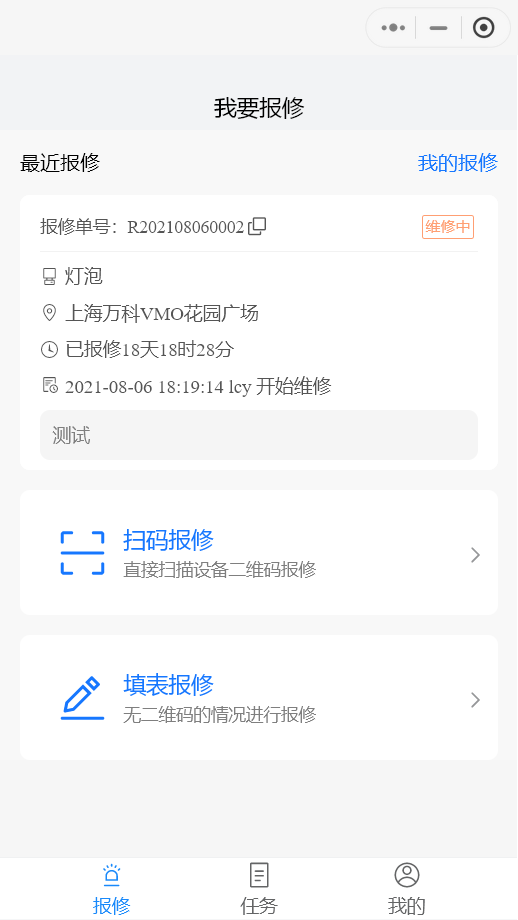
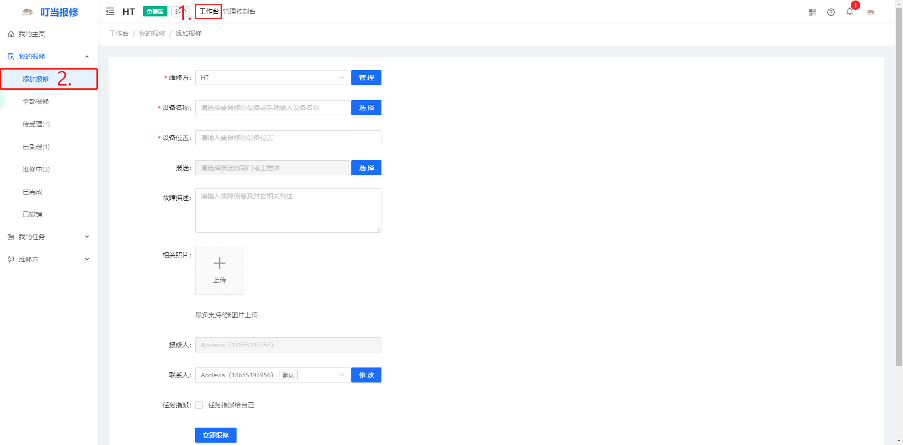
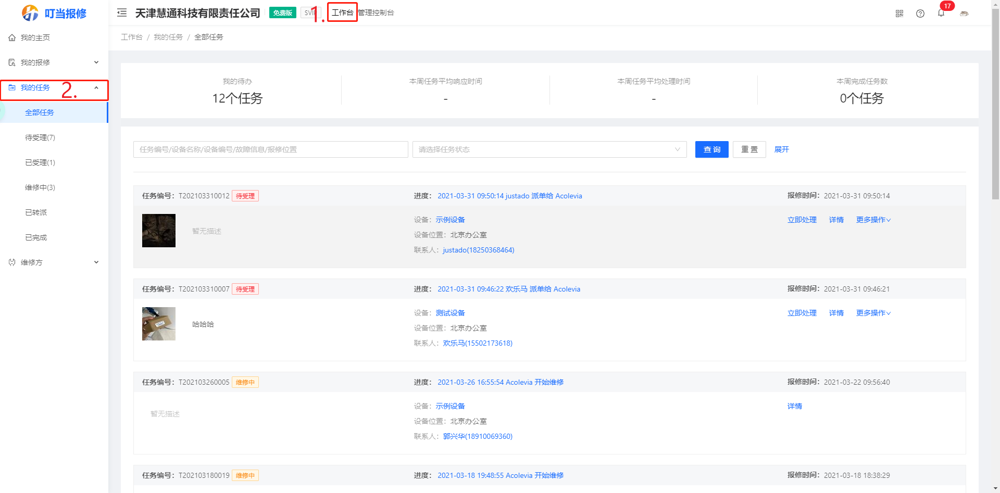
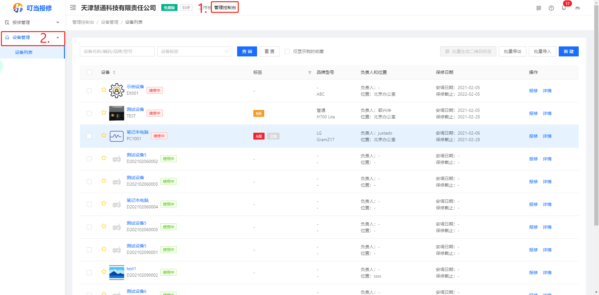
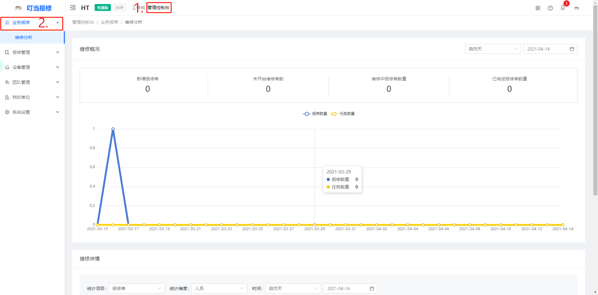

**叮当报修帮助文档**

# 快速开始指南

## 如何报修

系统支持扫码报修和填单报修两种报修方式

若设备粘贴由叮当报修系统生成的二维码，可直接使用“微信扫一扫”进行报修；

若设备已有资产编码，则需进入叮当报修的小程序点击“扫码报修”来进行报修；

若设备数量较多，无法一一编码，报修人亦可手动填写报修单

| **报修方式**   | **详细说明**                                                                                                                                                                                  |
|----------------|-----------------------------------------------------------------------------------------------------------------------------------------------------------------------------------------------|
| 直接扫码报修   | 若有web端生成的设备二维码，可直接用微信扫一扫进行报修 若设备已有资产编码，可在web端的设备列表下新建对应的设备，在自定义编码一栏录入设备的编码，然后打开叮当报修的小程序点击扫码报修来进行报修 |
| 填写报修单报修 | 针对无二维码情况，用户还可直接进行填表报修，选择维修方，录入故障信息（支持拍摄并上传照片、语音报修），即可提交报修                                                                            |

## 如何维修

| **操作步骤**         | **详细说明**                                                                                                                                                                                                                                                                             |
|----------------------|------------------------------------------------------------------------------------------------------------------------------------------------------------------------------------------------------------------------------------------------------------------------------------------|
| 第一步  创建单位账户 | 若已有单位账户，则创建单位账户，生成单位二维码                                                                                                                                                                                                                                           |
| 第二步  添加设备台账 | 叮当报修支持基于资产（设备台账）的报修，报修可关联至具体设备，用户扫码后即可直接带出设备信息；若不进行设备台账管理，可跳过此步骤  若需使用叮当报修进行设备资产管理，可在后台（https://baoxiu.larkea.com/）录入或批量导入设备台账，每个设备均有唯一的二维码编码，可通过微信扫一扫直接查看 |
| 第三步 维修单派工    | 方式1：手动派工 管理员指派维修单给维修工程师 方式2：智能派工 系统根据设备维修负责人自动指派给工程师，此方式下无需进行派工 方式3：主动认领 维修工程师在报修池中主动认领                                                                                                                   |
| 第四步 维修任务执行  | 指派给维修工程师或维修工程师认领的任务，工程师可打开自己的任务列表，查看派给自己的任务，录入故障分类/备件/维修记录                                                                                                                                                                       |

## 创建我的单位

可选择小程序创建或者web端（https://baoxiu.larkea.com/）创建，两者数据互通；

两者都需填写单位名称，单位简介和单位类型；

不同的是，小程序可选择单位的地区，web端可上传公司的Logo以及扫码报修和加入单位的权限

# 小程序

## 如何进入小程序

| **进入方式** | **详细说明**           |
|--------------|------------------------|
| 小程序搜索   | 搜索叮当报修           |
| 扫码进入     | 单位二维码、设备二维码 |

## 报修功能

系统支持扫码报修和填表报修两种报修方式；若需要查询详细功能，请登录web端（https://baoxiu.larkea.com/）

## 任务功能

注：任务功能只有工程师以上的级别能查看和操作

| 功能点       | 详细说明                                                                                             |
|--------------|------------------------------------------------------------------------------------------------------|
| 任务查询     | 首页任务栏页面下的任务都是已经分配给当前工程师的任务                                                 |
| 维修任务认领 | 在我的页面的报修池下，点击待受理的任务再点击我来维修来认领任务                                       |
| 任务协同     | 需要多个工程师共同维修的情况，领取任务后，点击更多操作，再点击协同，然后选择想要报送的团队或个人     |
| 任务转派     | 转派成功后，任务与当前工程师无关，领取任务后，点击更多操作，再点击转派，然后选择想要报送的团队或个人 |

## 设备收藏

可在设备详情页面收藏，也可在我的设备下批量收藏

## 个人设置

在我的信息页面可以修改头像，姓名，手机号码，邮箱号码，查看所属单位的信息，如果是工程师以上级别还可查看团队里的成员；

设置页面可以退出账号，切换单位

# 网页版

## 维修订单管理

web端仅支持填表报修，数据与小程序互通；若想快速报修，请在微信小程序搜索“叮当报修”

## 维修任务管理

数据与小程序互通，能看到更多详细数据，例如任务处理的时间，本周完成的任务等

## 设备台账管理

可查询与设备相关联的信息，设备的维修记录；批量导出和导入设备，生成二维码

## 分支机构管理

需要管理员以上权限才能查看，可创建多个部门，以对应不同的维修情况

## 维修数据分析

需要管理员以上权限才能查看，可以看到一段时间的报修总体的情况，以及每个人完成的任务量，完成任务的时间等数据

# FAQ

## 如何获取设备二维码？

在web端的管理控制台下的设备列表里，点击设备的详情**，**在设备名称下有个二维码的图标，鼠标悬停在图标上，即可获得设备的二维码，如果没有设备，请在设备列表下新建设备，然后重复上述操作

## 设备已有编码是否可以使用？

可以，但是要把设备的编码录入叮当报修的系统中，并且要打开叮当报修的小程序进行报修

若系统中没有设备，则需在管理控制台的设备列表中新建设备，并把设备的编码录入自定义编码一栏中

若系统中已经有此设备，则需在管理控制台的设备列表中查看此设备的详情，然后点击修改设备信息，把设备的编码录入自定义编码一栏中

