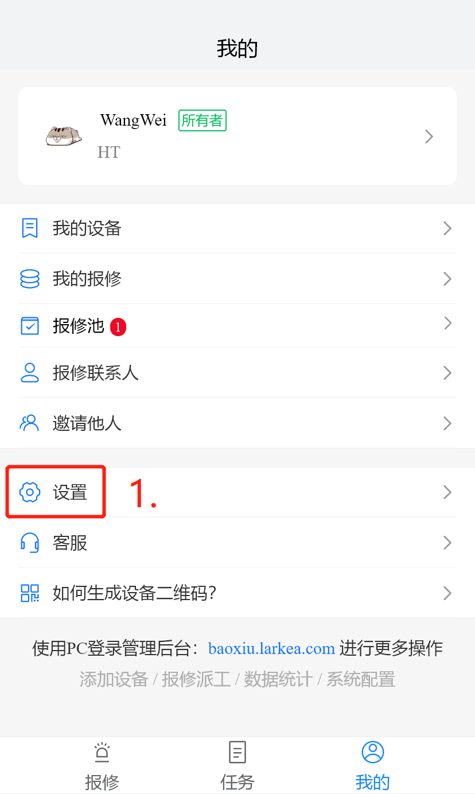

# 小程序
[[toc]]

## 如何进入小程序

| **进入方式** | **详细说明**           |
| ------------ | ---------------------- |
| 小程序搜索   | 搜索叮当报修           |
| 扫码进入     | 单位二维码、设备二维码 |

## 报修功能

系统支持扫码报修和填表报修两种报修方式

::: tip 提示
若需要查询详细功能，请登录web端（[https://baoxiu.larkea.com/](https://baoxiu.larkea.com)）
:::

## 任务功能

::: warning 注意
任务功能只有工程师以上的级别能查看和操作
:::

| 功能点       | 详细说明                                                     |
| ------------ | ------------------------------------------------------------ |
| 任务查询     | 首页任务栏页面下的任务都是已经分配给当前工程师的任务         |
| 维修任务认领 | 在我的页面的报修池下，点击待受理的任务再点击我来维修来认领任务 |
| 任务协同     | 需要多个工程师共同维修的情况，领取任务后，点击更多操作，再点击协同，然后选择想要报送的团队或个人 |
| 任务转派     | 转派成功后，任务与当前工程师无关，领取任务后，点击更多操作，再点击转派，然后选择想要报送的团队或个人 |

## 设备收藏

### 单个设备收藏

* 设备详情页面收藏

### 多个设备批量收藏

* 在我的设备下批量收藏

## 个人设置

在我的信息页面可以修改头像，姓名，手机号码，邮箱号码，查看所属单位的信息；

::: warning 注意
工程师以上级别，还可查看公司的部门以及部门里的成员
:::

设置页面可以退出账号，切换单位

