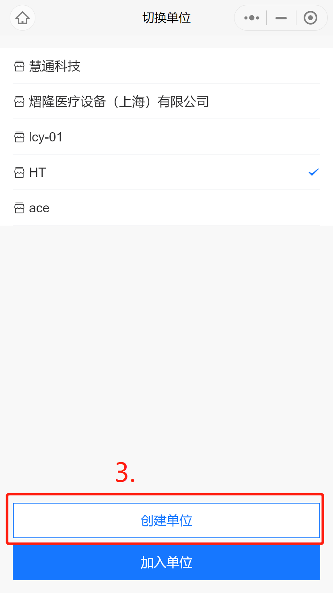

# 创建单位
[[toc]]

## 创建我的单位

可选择小程序创建或者web端（[https://baoxiu.larkea.com/](https://baoxiu.larkea.com)）创建，两者数据互通；

### 小程序创建

我的-设置-切换单位-创建设备，需填写单位名称，单位简介，地区和单位类型；

### web端创建

需填写单位名称，单位简介和单位类型

::: tip 提示
小程序可选择单位的地区，web端可上传公司的Logo以及扫码报修和加入单位的权限
:::
