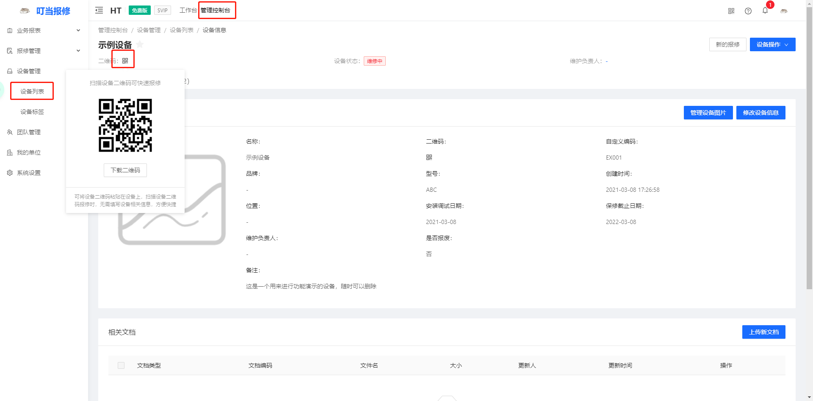
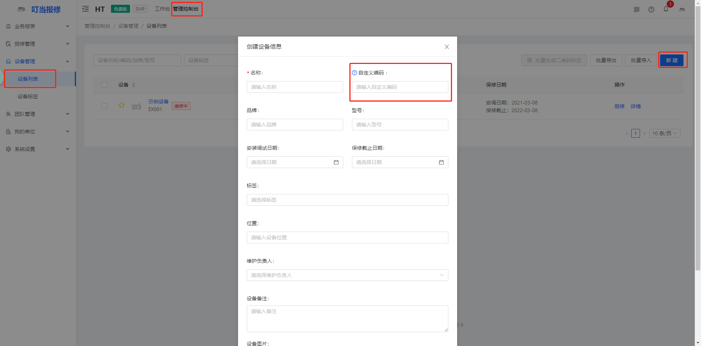
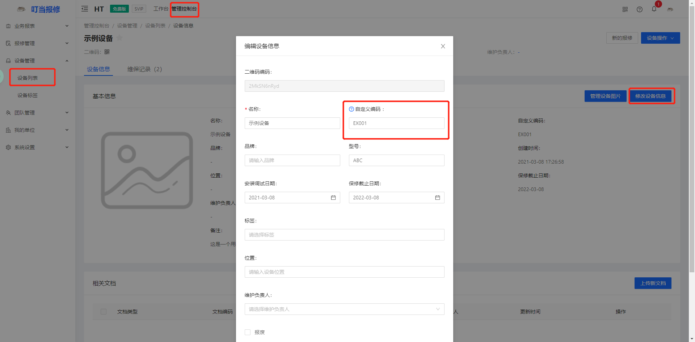

# FAQ

## 如何获取设备二维码？

在web端的管理控制台下的设备列表里，点击设备的详情**，**在设备名称下有个二维码的图标，鼠标悬停在图标上，即可获得设备的二维码，如果没有设备，请在设备列表下新建设备，然后重复上述操作

## 设备已有编码是否可以使用？

可以，但是要把设备的编码录入叮当报修的系统中，并且要打开叮当报修的小程序进行报修

若系统中没有设备，则需在管理控制台的设备列表中新建设备，并把设备的编码录入自定义编码一栏中

若系统中已经有此设备，则需在管理控制台的设备列表中查看此设备的详情，然后点击修改设备信息，把设备的编码录入自定义编码一栏中

