# 如何获取设备二维码？
[[toc]]

## 方式1：小程序直接打印单位报修码

配置蓝牙条码打印机后，在设置页面下方点击打印单位报修二维码，即可实现单位报修码打印

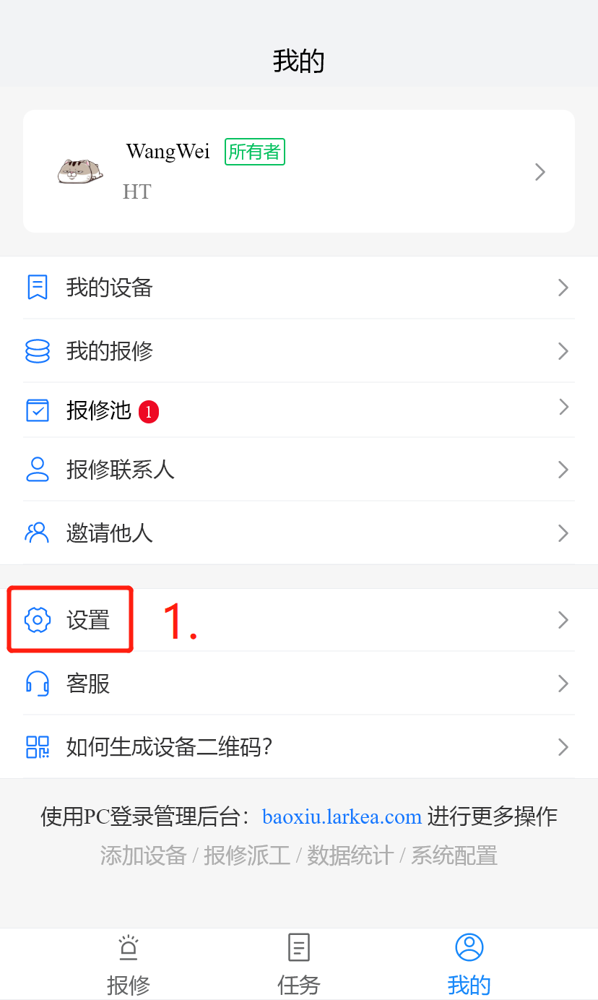

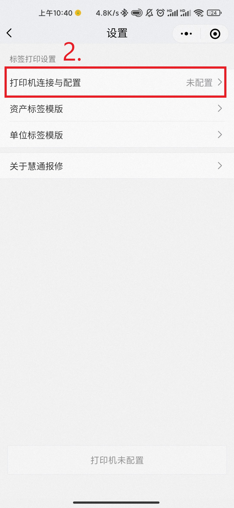

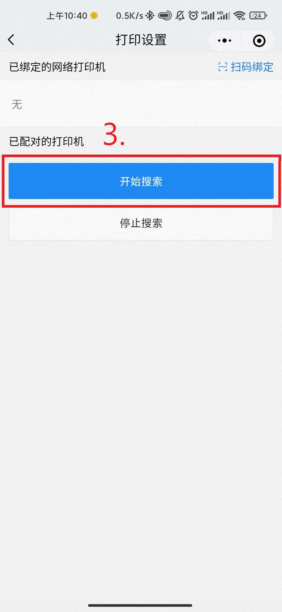

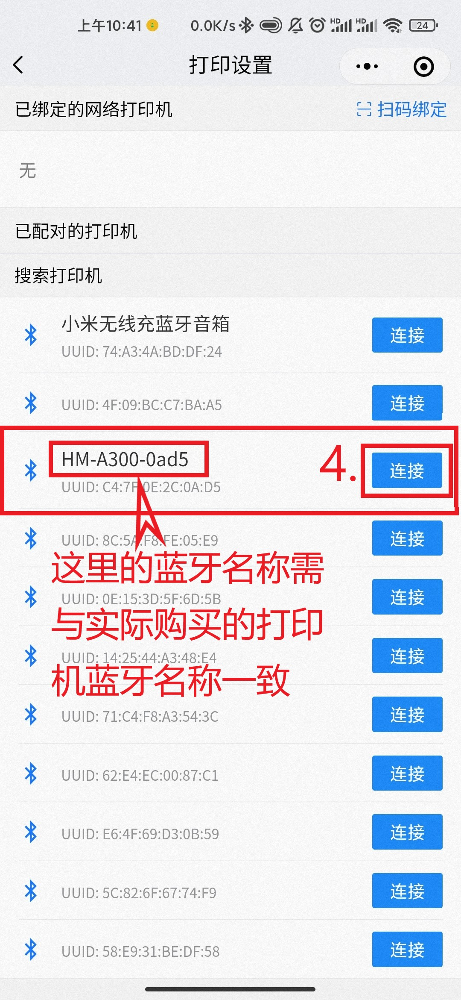

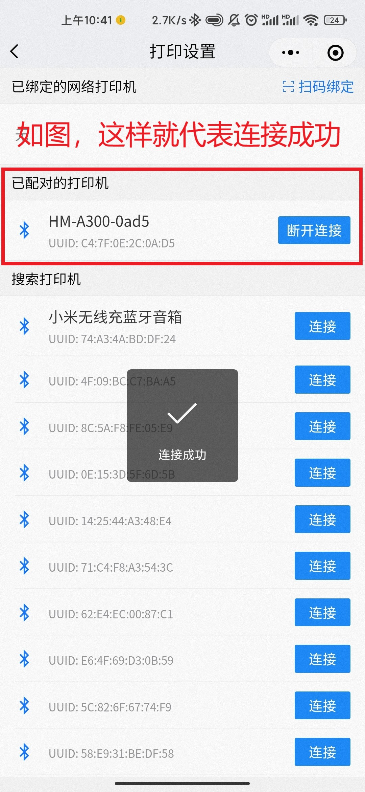

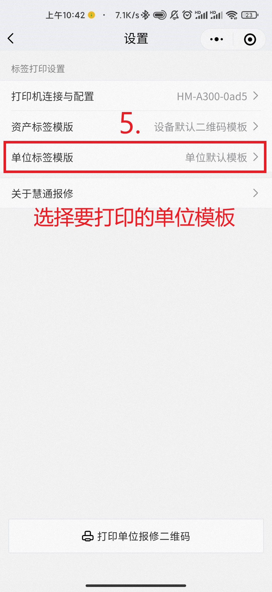

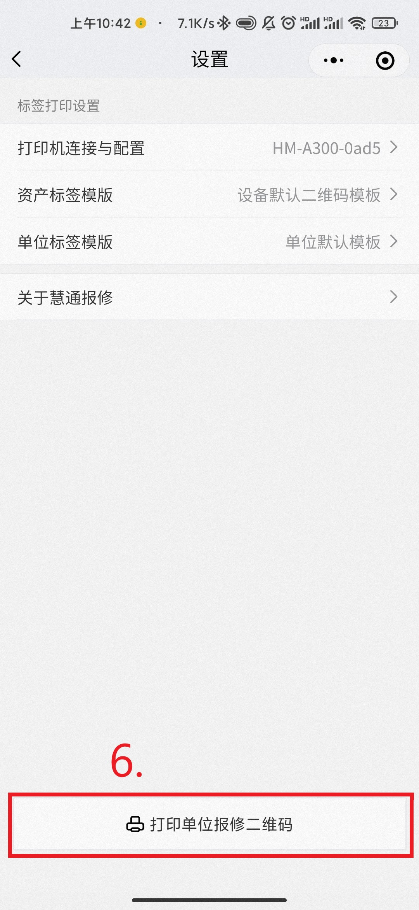

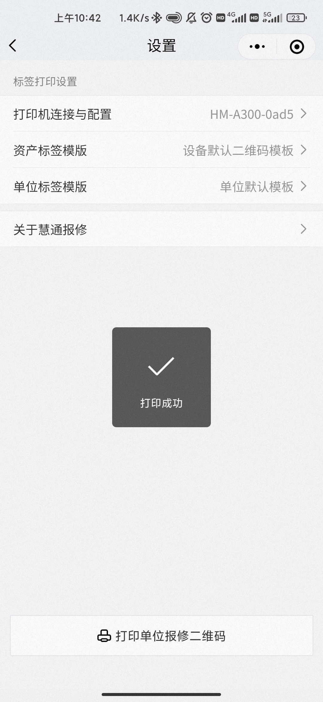

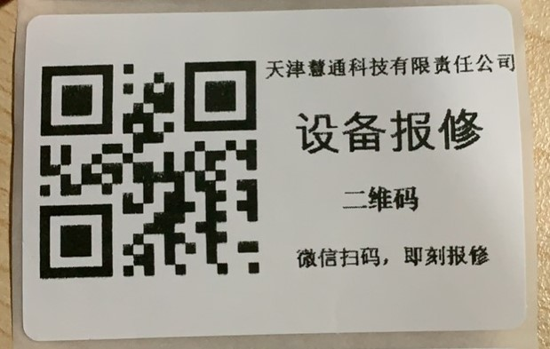

## 方式2：小程序打印资产报修二维码

配置蓝牙条码打印机后，在设备首页点击二维码，即可实现资产报修二维码打印

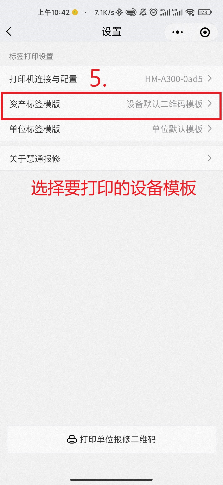

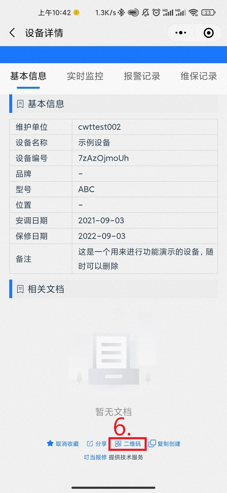

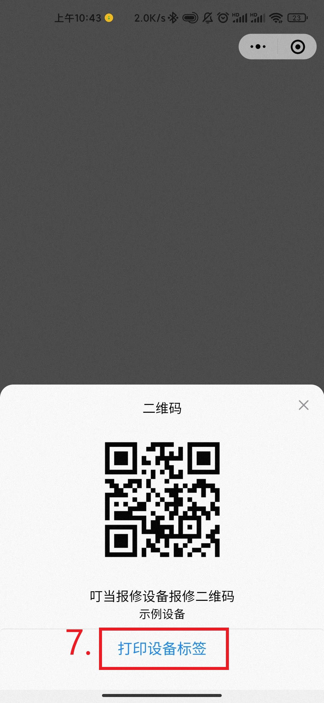

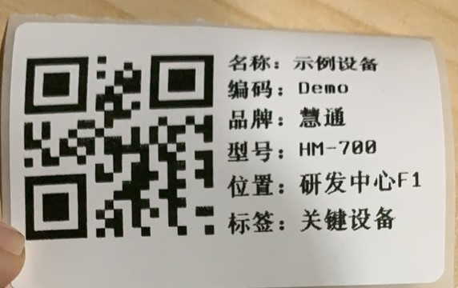

## 方式3：后台查看并打印设备二维码

登录管理后台：[baoxiu.larkea.com](https://baoxiu.larkea.com) ，在web端的管理控制台下的设备列表里，点击设备的详情，在设备详情页面中可浏览、下载、打印设备设备二维码（打印二维码需使用配套标签打印机并安装驱动，详情联系客服），鼠标悬停在图标上，即可获得设备的二维码，如果没有设备，请在设备列表下新建设备，然后重复上述操作

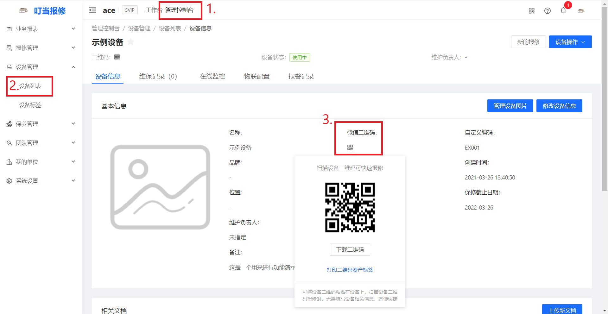

## 方式4：批量导出设备二维码

::: warning 注意
只有公司的所有者才能批量生成二维码
:::

登录管理后台：baoxiu.larkea.com ，在管理控制台
/设备管理/设备列表中点击【批量导出二维码标签】，即可将所选设备二维码标签批量导出。

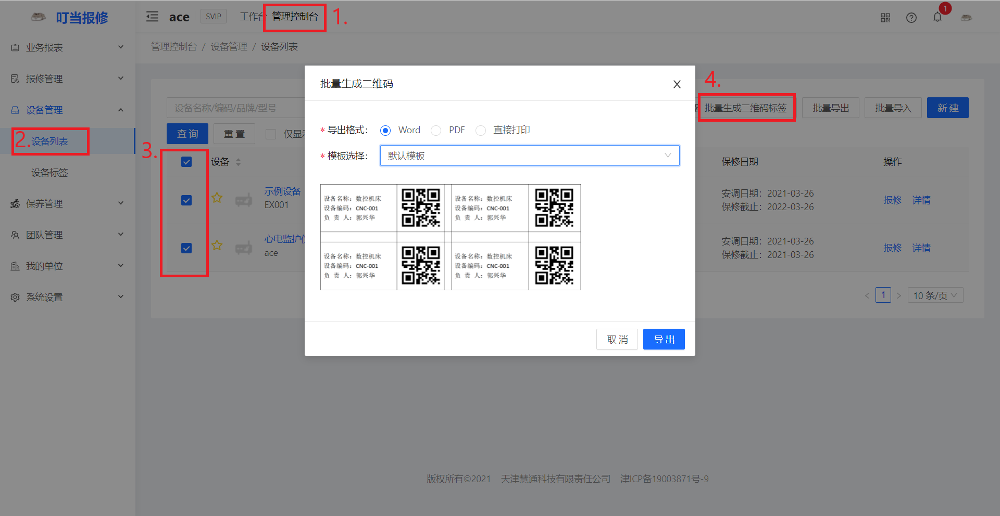

## 方式5：其它定制化需求

如您有标签打印设备采购/批量标签定制或其他需求，可致电客服热线 18910069360（同微信），可为您提供一站式解决方案。
