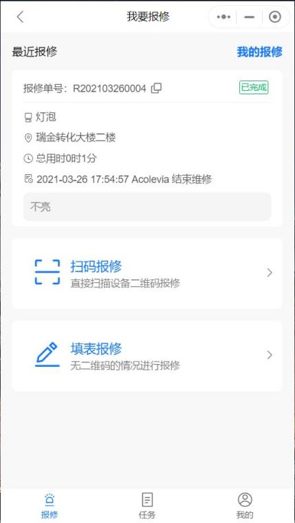
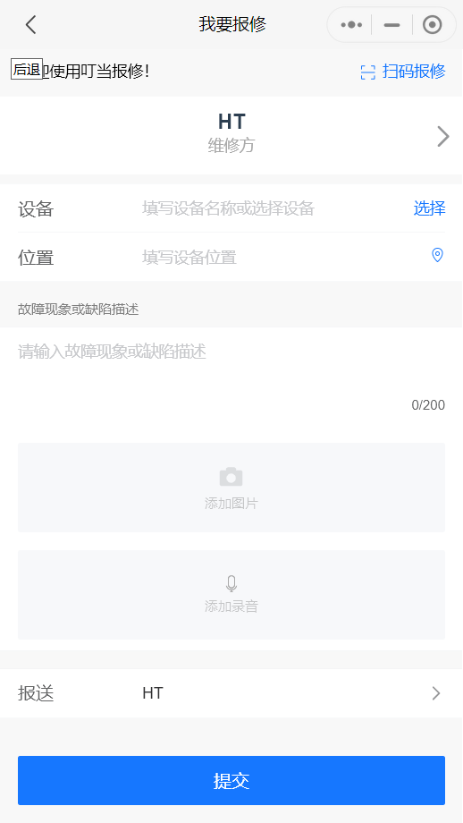

## 如何报修

系统支持扫码报修和填单报修两种报修方式

若设备粘贴由叮当报修系统生成的二维码，可直接使用“微信扫一扫”进行报修；

若设备已有资产编码，则需进入叮当报修的小程序点击“扫码报修”来进行报修；

若设备数量较多，无法一一编码，报修人亦可手动填写报修单

| **报修方式**   | **详细说明**                                                 |
| -------------- | ------------------------------------------------------------ |
| 直接扫码报修   | 若有web端生成的设备二维码，可直接用微信扫一扫进行报修 若设备已有资产编码，可在web端的设备列表下新建对应的设备，在自定义编码一栏录入设备的编码，然后打开叮当报修的小程序点击扫码报修来进行报修 |
| 填写报修单报修 | 针对无二维码情况，用户还可直接进行填表报修，选择维修方，录入故障信息（支持拍摄并上传照片、语音报修），即可提交报修 |

## 如何维修

| **操作步骤**         | **详细说明**                                                 |
| -------------------- | ------------------------------------------------------------ |
| 第一步  创建单位账户 | 若已有单位账户，则创建单位账户，生成单位二维码               |
| 第二步  添加设备台账 | 叮当报修支持基于资产（设备台账）的报修，报修可关联至具体设备，用户扫码后即可直接带出设备信息；若不进行设备台账管理，可跳过此步骤  若需使用叮当报修进行设备资产管理，可在后台（[https://baoxiu.larkea.com/](https://baoxiu.larkea.com)）录入或批量导入设备台账，每个设备均有唯一的二维码编码，可通过微信扫一扫直接查看 |
| 第三步 维修单派工    | 方式1：手动派工 管理员指派维修单给维修工程师 方式2：智能派工 系统根据设备维修负责人自动指派给工程师，此方式下无需进行派工 方式3：主动认领 维修工程师在报修池中主动认领 |
| 第四步 维修任务执行  | 指派给维修工程师或维修工程师认领的任务，工程师可打开自己的任务列表，查看派给自己的任务，录入故障分类/备件/维修记录 |