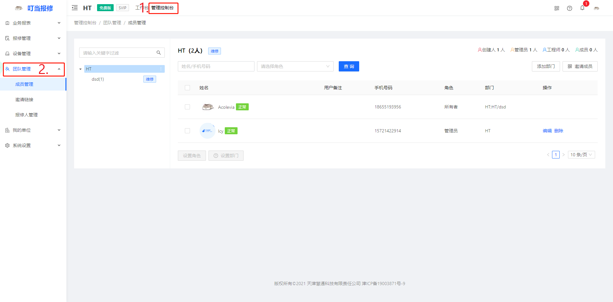

# 网页版

## 维修订单管理

[web端](https://baoxiu.larkea.com)仅支持填表报修，数据与小程序互通；若想快速报修，请在微信小程序搜索“叮当报修”

## 维修任务管理

数据与小程序互通，能看到更多详细数据，例如任务处理的时间，本周完成的任务等

## 设备台账管理

可查询与设备相关联的信息，设备的维修记录；批量导出和导入设备，生成二维码

## 分支机构管理

需要管理员以上权限才能查看，可创建多个部门，以对应不同的维修情况

## 维修数据分析

需要管理员以上权限才能查看，可以看到一段时间的报修总体的情况，以及每个人完成的任务量，完成任务的时间等数据

